# Worm Physics Game - Product Requirements Document

## 1. Game Overview

### Core Concept
A physics-based platformer where players control a segmented worm using analog stick controls for head and tail movement. The game emphasizes skill expression through emergent physics-based maneuvers including jumps, flips, extensions, and complex aerial tricks.

### Target Audience
- **Primary**: Streamers and speedrunners seeking skill-based content
- **Secondary**: Players who enjoy physics-based platformers and trick scoring systems

### Core Pillars
1. **Responsive Physics**: Predictable, skill-based movement system
2. **Emergent Mastery**: Advanced techniques discoverable through physics exploration
3. **Streaming Appeal**: Visually spectacular moments and natural retry loops
4. **Speedrun Optimization**: Consistent mechanics enabling route discovery and time optimization

## 2. Core Mechanics

### 2.1 Worm Physics System

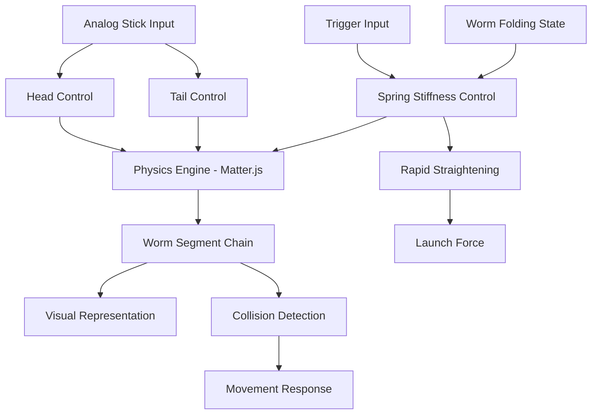

**Specifications:**
- **Worm Composition**: 12 segments with radius 15 (largest) to 11 (smallest)
- **Physics Engine**: Matter.js
- **Control Scheme**: Dual analog sticks (head/tail independent control)
- **Extension System**: Trigger-controlled spring stiffness for rapid straightening
- **Chain Physics**: Rope-like behavior enabling natural pendulum and elastic motions

### 2.2 Movement Capabilities

**Core Movements:**
- Basic locomotion via head/tail coordination
- Extension jumps using trigger-controlled straightening force
- Natural physics enabling: pogo jumps, flips, twists, pendulum swings
- Launch potential: Up to 3x worm length in distance/height based on folding and trigger pressure

**Emergent Techniques:**
- Gymnastic maneuvers through momentum conservation
- Precision platforming via segment control
- High-speed traversal combining multiple movement types

## 3. Game Modes and Structure

### 3.1 Training Mode

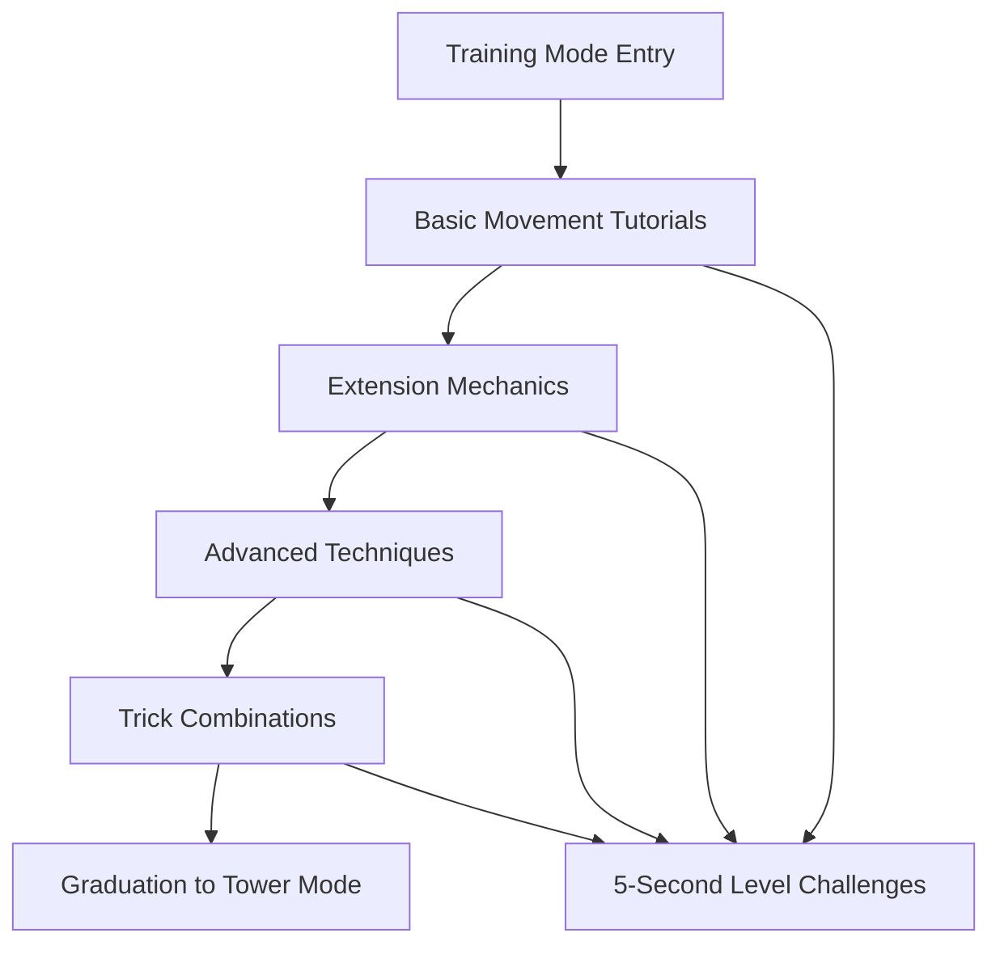

**Purpose**: Skill development and mechanic familiarization
**Structure**: Progressive tutorial levels teaching specific techniques
**Level Design**: 5-second completion time for skilled players
**Objective**: Single goal per level (touch the star)

### 3.2 Tower Mode (Primary Challenge)

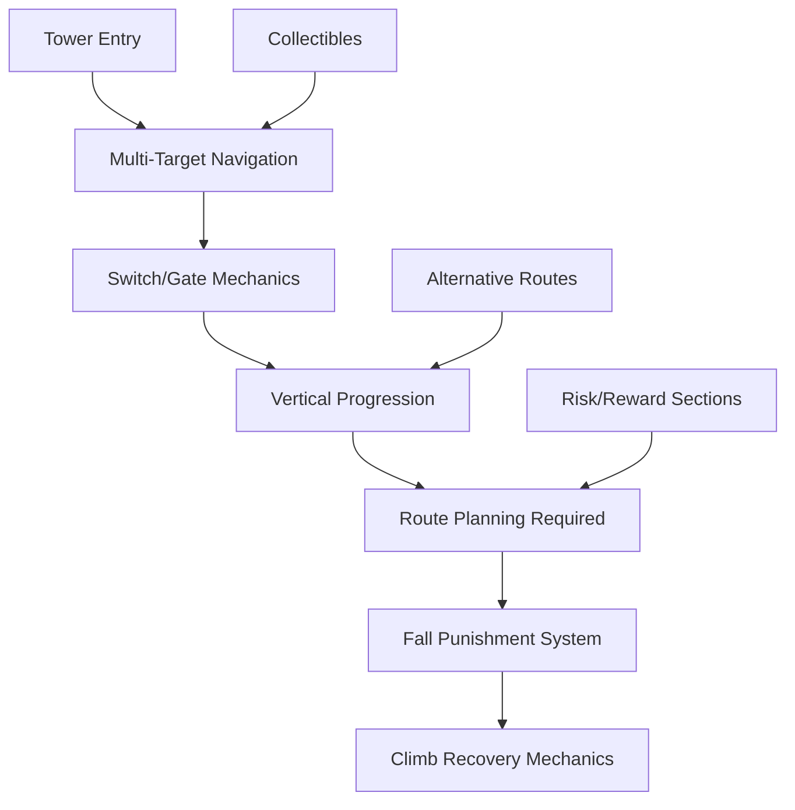

**Core Features:**
- **Multi-target objectives**: Multiple stars, switches, gates per section
- **Vertical design**: Climbing-focused with fall punishment
- **Route planning**: Multiple viable paths with skill/risk tradeoffs
- **Progressive difficulty**: Advanced sections require mastery of multiple techniques

**Punishment System:**
- Falls result in downward progression loss
- Players must re-climb to previous position
- No permanent failure states

## 4. Time Machine System

### 4.1 State Management

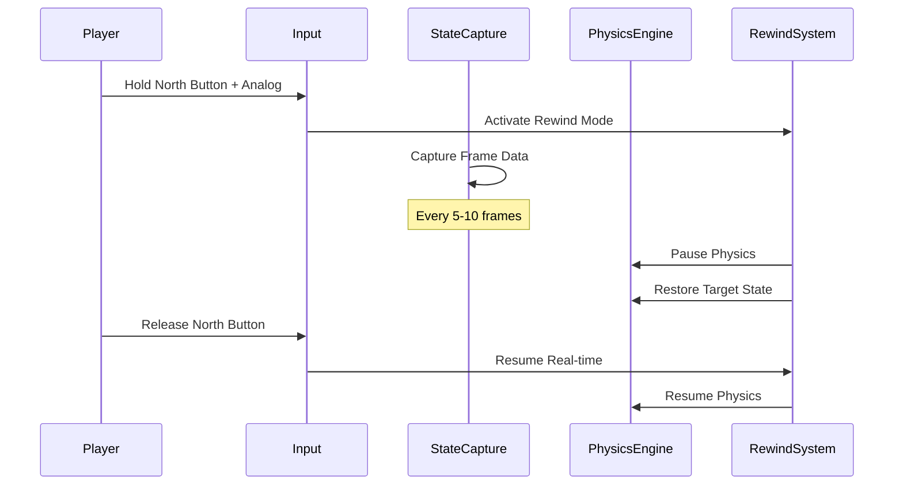

**Technical Requirements:**
- **State Capture**: Position, velocity, angle, angular velocity for all worm segments
- **Capture Frequency**: Every 5-10 frames to balance memory usage
- **Storage Duration**: Maximum 5-10 seconds of history
- **Memory Management**: Circular buffer with automatic cleanup

### 4.2 Control Scheme

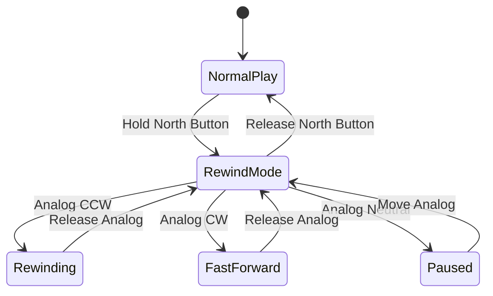

**Control Mapping:**
- **Activation**: Hold North button (Y/Triangle)
- **Rewind Speed**: Analog stick counter-clockwise
- **Fast Forward**: Analog stick clockwise
- **Precision**: Analog magnitude determines speed

**Visual Effects:**
- Particle trails flowing backwards during rewind
- Chromatic aberration/time distortion effects
- Timeline scrubber UI display
- Ghost trails showing previous positions

## 5. Trick Detection and Scoring System

### 5.1 Trick Categories

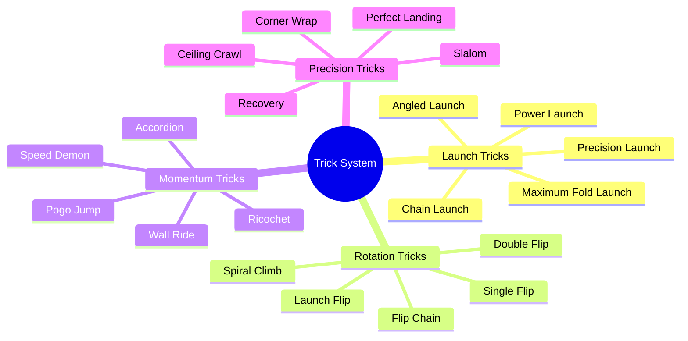

### 5.2 Detection Algorithm

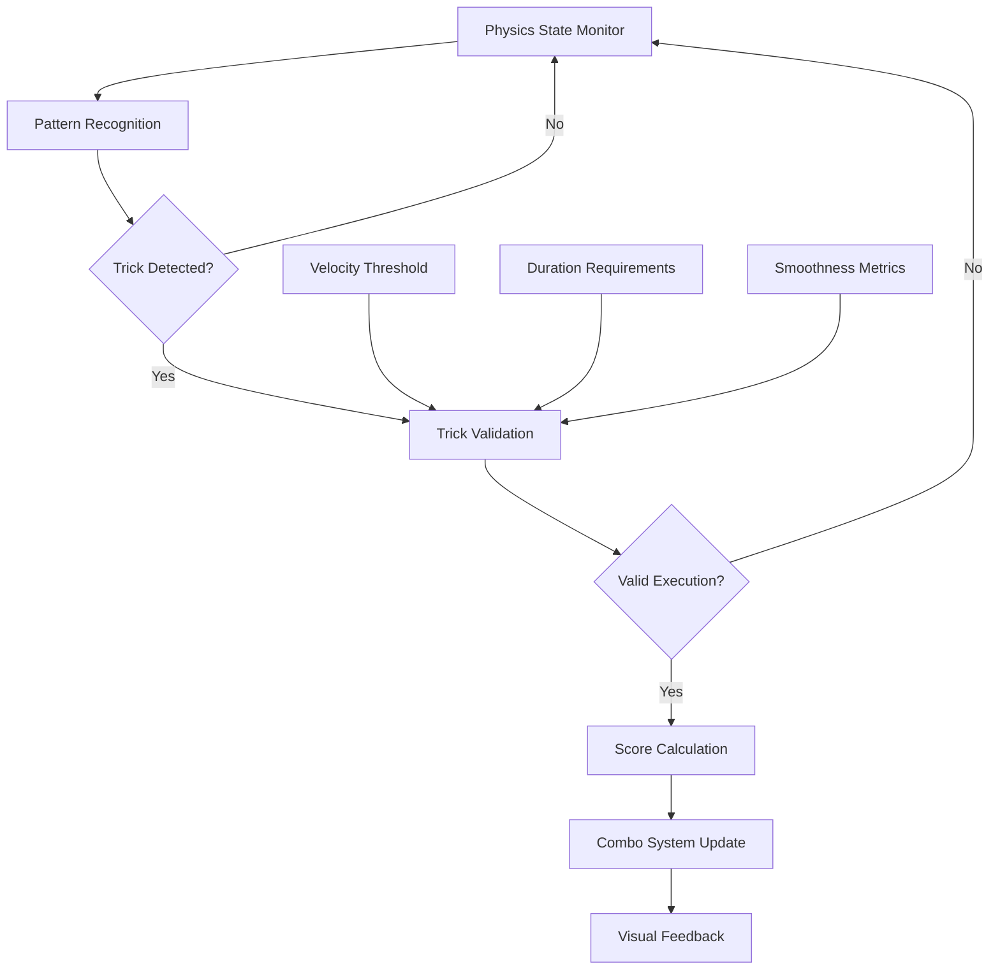

**Detection Parameters:**
- **Flip Detection**: Angular momentum > threshold + complete rotation
- **Pogo Detection**: Compression cycles + rhythmic ground contact
- **Launch Detection**: Rapid straightening force + resulting trajectory distance
- **Fold Quality**: Degree of worm compression before launch
- **Style Modifiers**: Smoothness metrics, air time, launch power efficiency

### 5.3 Scoring Framework

**Base Scores:**
- Basic Jump: 100 points
- Power Launch: 200 points + distance bonus
- Flip: 500 points per rotation
- Pogo: 300 points + 100 per consecutive bounce
- Perfect Landing: 2x multiplier
- Maximum Fold Launch: 3x multiplier

**Combo System:**
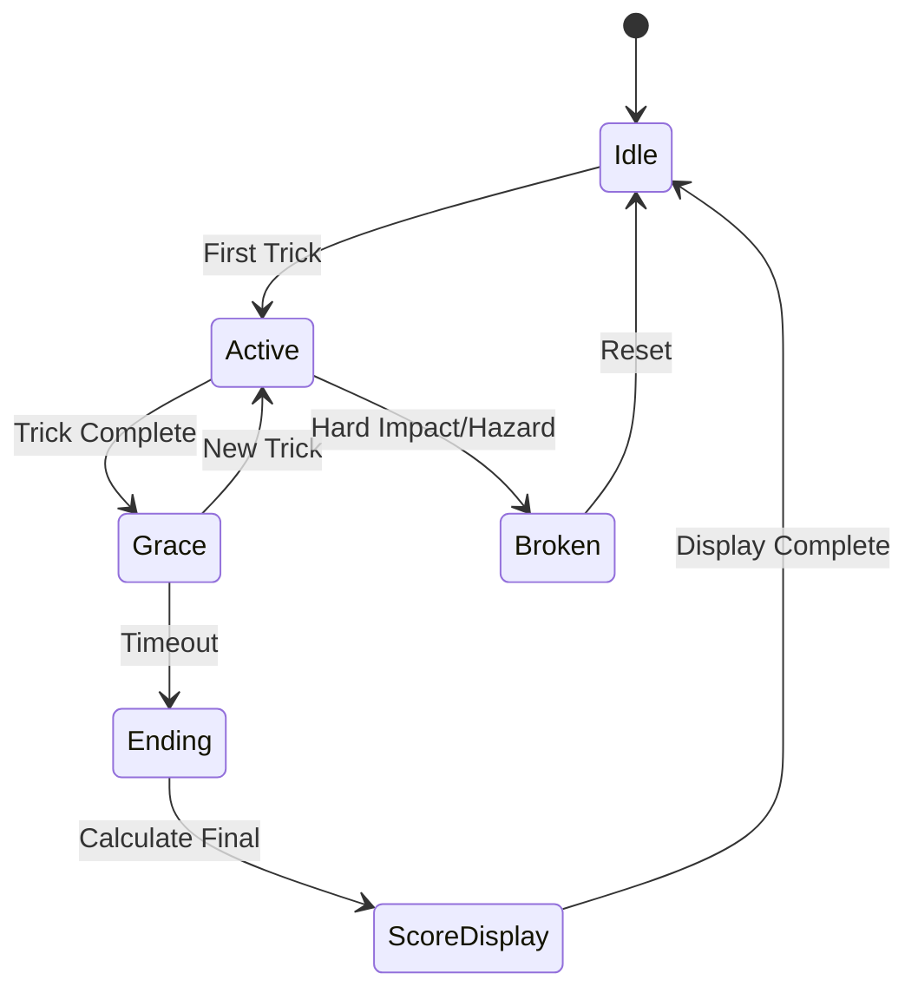

**Combo Rules:**
- **Grace Period**: 1-2 seconds after trick completion
- **Break Conditions**: Hard impacts, hazards, full stop on ground
- **Multipliers**: Consecutive tricks increase score exponentially

## 6. Camera System

### 6.1 Dynamic Zoom

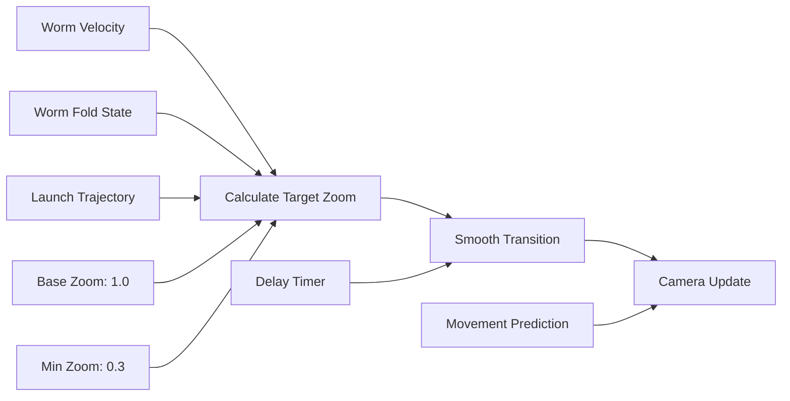

**Zoom Algorithm:**
- **Base Zoom**: 1.0 for stationary/slow movement
- **Minimum Zoom**: 0.3 for maximum velocity or major launches
- **Fold Factor**: Additional zoom-out when worm is highly compressed (anticipating launch)
- **Trajectory Zoom**: Dynamic zoom based on predicted launch distance
- **Smooth Transitions**: Lerp with delay before zoom-in recovery

### 6.2 Camera Behavior

**Velocity-Based Scaling:**
```
targetZoom = baseZoom - (wormSpeed / maxSpeed) * (baseZoom - minZoom)
```

**Predictive Following:**
- Camera leads slightly during fast movement
- Temporary pull-back during anticipated launches (when worm is highly folded)
- Zoom out to frame entire launch trajectory
- Dynamic framing based on worm compression state

## 7. Level Design Systems

### 7.1 Training Level Structure

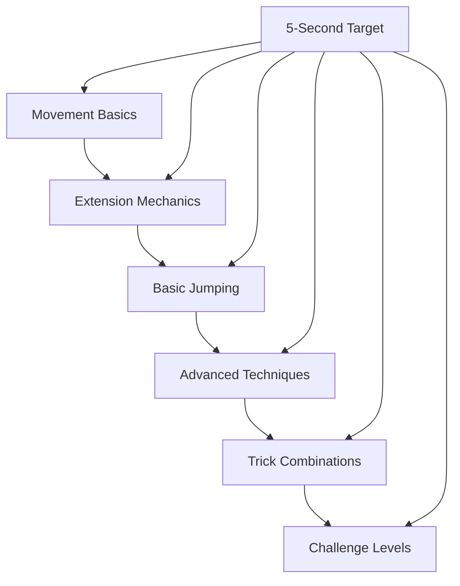

**Design Principles:**
- **Single Objective**: Touch the star
- **5-Second Completion**: Target time for skilled players
- **Progressive Difficulty**: Each level introduces or combines techniques
- **Retry-Friendly**: Immediate restart capability

### 7.2 Tower Design

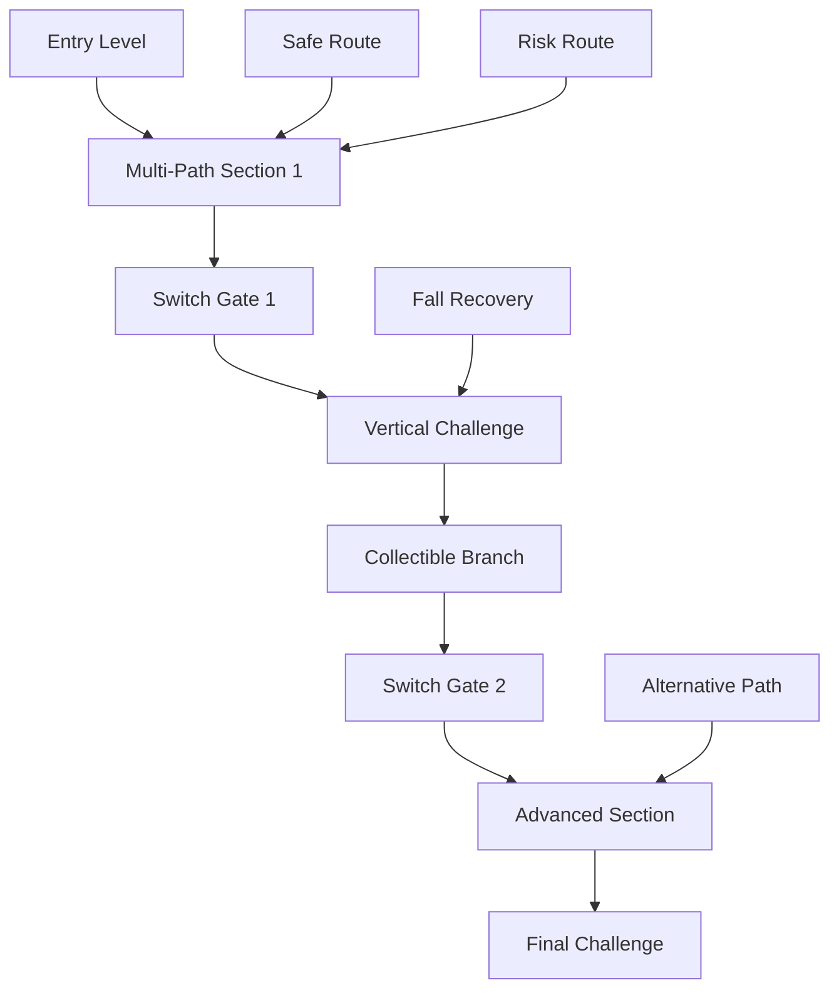

**Tower Features:**
- **Multiple Collectibles**: Stars, switches, special items per section
- **Gate Mechanics**: Require backtracking and route planning
- **Difficulty Scaling**: Progressive skill requirements
- **Fall Punishment**: Lose elevation, must re-climb
- **Route Variety**: Multiple viable paths with different skill requirements

## 8. Technical Specifications

### 8.1 Physics Requirements

**Matter.js Configuration:**
- **Engine**: Standard Matter.js physics engine
- **Body Types**: Circular segments with constraints
- **Collision Detection**: Continuous for all worm segments
- **Constraint System**: Rope-like connections between segments

**Performance Targets:**
- **Frame Rate**: 60 FPS consistent
- **Physics Steps**: 60Hz physics updates
- **Segment Count**: 12 segments maximum
- **Constraint Stability**: No constraint breaking under normal play

### 8.2 Data Management

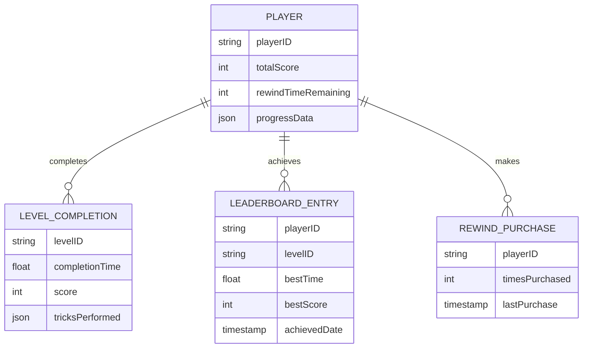

### 8.3 Leaderboard Integration

**Platform Integration:**
- **Steam Leaderboards**: Primary platform for PC
- **Speedrun.com Compatibility**: Export format for community boards
- **Local Storage**: Offline leaderboards for guest play
- **Account Sync**: Cross-device progress synchronization

**Data Points:**
- Completion times per level
- Trick scores and combinations
- Perfect completion rates
- Rewind usage statistics

## 9. User Interface Systems

### 9.1 HUD Elements

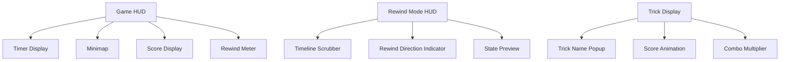

**Standard HUD:**
- **Timer**: Precision timing display (0:00.00 format)
- **Minimap**: Enhanced navigation with hints and collectible markers
- **Score**: Real-time trick scoring with combo indicators
- **Rewind Meter**: Available rewind time remaining

**Rewind Mode Interface:**
- **Timeline Scrubber**: Visual timeline with position indicator
- **Direction Arrows**: Clear indication of rewind/fast-forward direction
- **State Preview**: Ghost worm showing target position

### 9.2 Visual Feedback Systems

**Trick Recognition:**
- Popup text with trick names and scores
- Screen effects (shake, flash, particle bursts)
- Worm visual effects (glow, trails, color shifts)
- Audio cues matching visual feedback

**Physics Enhancement:**
- Particle trails during high-speed movement
- Impact effects on collisions
- Extension visualization during stretching
- Momentum lines showing trajectory

## 10. Monetization Framework

### 10.1 Rewind Time System

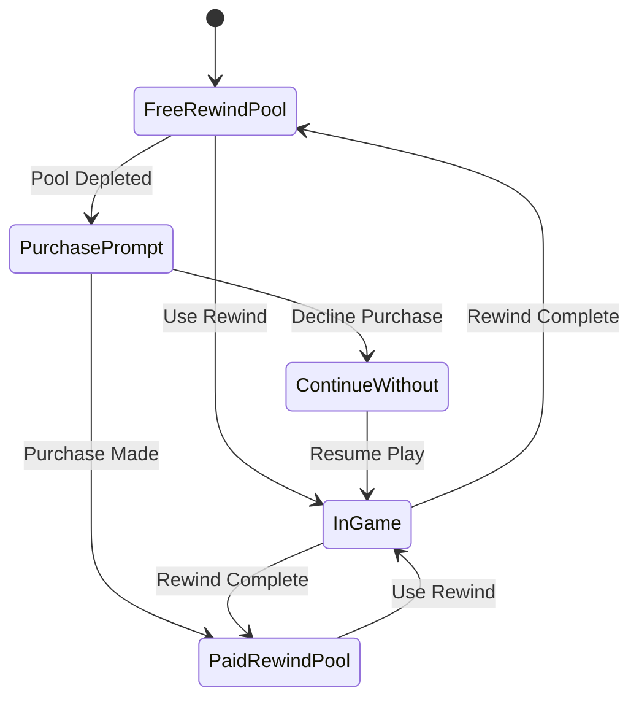

**Free Allocation:**
- **Base Amount**: Sufficient for normal learning and occasional mistakes
- **Regeneration**: Time-based or level-completion recovery
- **No Requirement**: Game fully playable without purchases

**Purchase Options:**
- **Small Pack**: 30 seconds additional rewind time
- **Medium Pack**: 2 minutes additional rewind time
- **Large Pack**: 10 minutes additional rewind time
- **Premium**: Unlimited rewind for premium players

### 10.2 Monetization Principles

**Fair Play Requirements:**
- Game completable without purchases
- Skill development not monetization-gated
- Rewind purchases are convenience only
- No pay-to-win mechanics in competitive modes

## 11. Platform and Technical Requirements

### 11.1 Target Platforms

**Primary Platform:**
- **PC/Steam**: Full feature set with Steam integration
- **Gamepad Support**: Xbox/PlayStation controller optimization
- **Keyboard Alternative**: Basic keyboard controls for accessibility

**Secondary Platforms:**
- **Mobile**: Touch controls with virtual analog sticks
- **Console**: PlayStation, Xbox, Nintendo Switch adaptation

### 11.2 Performance Specifications

**Minimum Requirements:**
- **Physics Calculations**: 60Hz stable with 12-segment worm
- **Rendering**: 60 FPS at 1080p minimum
- **Memory Usage**: Under 512MB for core gameplay
- **Storage**: Under 2GB total game size

**Optimization Targets:**
- **Physics Determinism**: Identical results from identical inputs
- **Network Sync**: Leaderboard data synchronization
- **Quick Load**: Under 2 seconds level restart time
- **Memory Management**: Efficient state history circular buffer

## 12. Success Metrics

### 12.1 Streaming Metrics

**Engagement Indicators:**
- Average session duration
- Retry rate per level
- Trick attempt frequency
- Social media clip generation rate

**Content Creation Support:**
- Built-in replay system
- Highlight detection and saving
- Easy sharing mechanisms
- Spectator-friendly visual design

### 12.2 Speedrunning Metrics

**Community Health:**
- Active leaderboard participation
- Route discovery rate
- Technique innovation frequency
- Community tutorial creation

**Technical Support:**
- Deterministic physics behavior
- Precise timing systems
- Anti-cheat compatibility
- Video verification support

---

*This PRD serves as the comprehensive specification for the worm physics game, focusing on emergent skill expression, streaming appeal, and speedrunning optimization while maintaining accessibility through progressive difficulty and optional monetization.*
